# 株式材料監視ダッシュボード DB設計書 v0.1

## 1. ドキュメント情報

| 項目      | 内容                             |
| ------- | ------------------------------ |
| ドキュメント名 | 株式材料監視ダッシュボード DB設計書            |
| バージョン   | 0.1                            |
| 対応要件定義  | 株式材料監視ダッシュボード v0.1.3           |
| DB      | Supabase PostgreSQL            |
| ORM     | Prisma                         |
| 目的      | 要件定義書 v0.1.3 を実装するためのDB構造を定義する |

---

## 2. DB設計の基本方針

### 2.1 事前計画と振り返りを分離する

本システムでは、取引前の判断と取引後の振り返りを明確に分ける。

| 種類   | テーブル                | 役割                  |
| ---- | ------------------- | ------------------- |
| 事前計画 | `trade_plans`       | 買い・見送り・監視継続の事前判断を保存 |
| 振り返り | `verification_logs` | 結果・学び・計画との差分を保存     |

理由は、後から都合よく判断理由を書き換えることを防ぎ、検証の質を上げるためである。

---

### 2.2 銘柄名はスナップショットとして保持する

銘柄情報は `stocks` に保持する。

ただし、開示情報・監視リスト・取引計画・検証ログには、登録時点の銘柄名を `stock_name_snapshot` として保持する。

理由：

* 銘柄名変更があっても当時の記録を保てる
* 検証ログを履歴として読みやすくできる
* 外部データ取得前の手動登録にも対応しやすい

---

### 2.3 CUIDを主キーにする

各テーブルの主キー `id` は CUID を使用する。

理由：

* Prismaとの相性が良い
* PostgreSQLでも扱いやすい
* ローカル開発・クラウド環境の両方で使いやすい

---

### 2.4 日時はUTC保存・JST表示

DBにはUTCで保存する。
画面表示時にJSTへ変換する。

| 項目   | 方針                    |
| ---- | --------------------- |
| DB保存 | UTC                   |
| 画面表示 | JST                   |
| 手動入力 | JSTとして受け取り、保存時にUTCへ変換 |

---

### 2.5 金額・価格はDecimal系で扱う

株価・金額・リスク%は、浮動小数点ではなく Decimal 系で扱う。

理由：

* 金額計算の誤差を避ける
* リスク計算・株数計算の精度を保つ

Prismaでは `Decimal`、PostgreSQLでは `numeric` を使用する。

---

## 3. テーブル一覧

| テーブル名               | 役割        |
| ------------------- | --------- |
| `stocks`            | 銘柄マスタ     |
| `disclosures`       | 注目開示情報    |
| `watchlist_items`   | 監視リスト     |
| `trade_plans`       | 取引計画      |
| `verification_logs` | 検証ログ      |
| `keyword_rules`     | 材料分類キーワード |
| `app_settings`      | アプリ設定     |

---

## 4. ER図

```mermaid
erDiagram
    stocks ||--o{ disclosures : "has"
    stocks ||--o{ watchlist_items : "has"
    stocks ||--o{ trade_plans : "has"
    stocks ||--o{ verification_logs : "has"

    disclosures ||--o{ watchlist_items : "source"
    disclosures ||--o{ trade_plans : "source"

    watchlist_items ||--o{ trade_plans : "source"

    trade_plans ||--o{ verification_logs : "has"

    stocks {
        string id PK
        string code UK
        string name
        string market
        text memo
        datetime created_at
        datetime updated_at
    }

    disclosures {
        string id PK
        string unique_key UK
        datetime disclosed_at
        string stock_code FK
        string stock_name_snapshot
        string title
        string url
        string primary_category
        json matched_categories
        int auto_score
        int user_priority
        boolean is_checked
        datetime created_at
        datetime updated_at
    }

    watchlist_items {
        string id PK
        string stock_code FK
        string stock_name_snapshot
        string disclosure_id FK
        text reason
        string category
        string status
        text watch_memo
        datetime created_at
        datetime updated_at
    }

    trade_plans {
        string id PK
        string stock_code FK
        string stock_name_snapshot
        string disclosure_id FK
        string watchlist_id FK
        string plan_type
        string plan_status
        text thesis
        text no_trade_reason
        decimal planned_entry_price
        decimal planned_stop_price
        decimal planned_take_profit_price
        int max_holding_days
        decimal account_size_snapshot
        decimal risk_percent
        decimal planned_risk_amount
        decimal planned_loss_per_share
        int trading_unit
        int recommended_quantity
        int planned_quantity
        decimal actual_entry_price
        int actual_quantity
        datetime executed_at
        datetime closed_at
        boolean is_locked
        datetime locked_at
        string locked_plan_hash
        datetime created_at
        datetime updated_at
    }

    verification_logs {
        string id PK
        string trade_plan_id FK
        string stock_code FK
        string stock_name_snapshot
        date review_date
        text result
        text lesson
        string followed_plan
        text deviation_summary
        text deviation_reason
        text next_rule
        datetime created_at
        datetime updated_at
    }

    keyword_rules {
        string id PK
        string keyword
        string category
        int score
        int priority
        boolean is_active
        datetime created_at
        datetime updated_at
    }

    app_settings {
        string id PK
        string key UK
        string value
        string value_type
        datetime created_at
        datetime updated_at
    }
```



---

## 5. Enum定義

PrismaではEnumとして定義する。

### 5.1 `WatchStatus`

| 値                 | 内容   |
| ----------------- | ---- |
| `UNCHECKED`       | 未確認  |
| `RESEARCHING`     | 調査中  |
| `BUY_CONSIDERING` | 買い検討 |
| `NO_TRADE`        | 見送り  |
| `CLOSED`          | 終了   |

---

### 5.2 `PlanType`

| 値          | 内容    |
| ---------- | ----- |
| `BUY`      | 買い計画  |
| `NO_TRADE` | 見送り計画 |
| `WATCH`    | 監視継続  |

---

### 5.3 `PlanStatus`

| 値           | 内容   |
| ----------- | ---- |
| `DRAFT`     | 下書き  |
| `COMMITTED` | 確定済み |
| `EXECUTED`  | 実行済み |
| `CLOSED`    | 終了   |

---

### 5.4 `FollowedPlan`

| 値         | 内容     |
| --------- | ------ |
| `YES`     | 計画通り   |
| `NO`      | 計画から逸脱 |
| `PARTIAL` | 一部計画通り |
| `UNKNOWN` | 未評価    |

---

### 5.5 `SettingValueType`

| 値         | 内容  |
| --------- | --- |
| `STRING`  | 文字列 |
| `NUMBER`  | 数値  |
| `BOOLEAN` | 真偽値 |

---

## 6. テーブル詳細

---

## 6.1 `stocks`：銘柄マスタ

### 目的

銘柄の基本情報を管理する。

### カラム定義

| カラム名         | 型        |  必須 | 制約     | 内容         |
| ------------ | -------- | --: | ------ | ---------- |
| `id`         | string   | Yes | PK     | CUID       |
| `code`       | string   | Yes | Unique | 銘柄コード      |
| `name`       | string   | Yes |        | 銘柄名        |
| `market`     | string   |  No |        | 市場区分       |
| `memo`       | text     |  No |        | 銘柄全体に関するメモ |
| `created_at` | datetime | Yes |        | 作成日時       |
| `updated_at` | datetime | Yes |        | 更新日時       |

### インデックス

| 対象     | 種類     | 目的           |
| ------ | ------ | ------------ |
| `code` | Unique | 銘柄コードによる一意検索 |
| `name` | Index  | 銘柄名検索        |

### 備考

* `code` は 4〜5文字の半角英数字を許容する
* 英字は大文字に正規化する
* 未登録銘柄が開示登録された場合、自動作成する

---

## 6.2 `disclosures`：注目開示情報

### 目的

ユーザーが気になった適時開示・材料情報を保存する。

全適時開示を保存するのではなく、ユーザーが注目した開示のみを登録する。

### カラム定義

| カラム名                  | 型        |  必須 | 制約            | 内容          |
| --------------------- | -------- | --: | ------------- | ----------- |
| `id`                  | string   | Yes | PK            | CUID        |
| `unique_key`          | string   | Yes | Unique        | 重複判定用キー     |
| `disclosed_at`        | datetime | Yes | Index         | 開示日時        |
| `stock_code`          | string   | Yes | FK            | 銘柄コード       |
| `stock_name_snapshot` | string   | Yes |               | 開示登録時点の銘柄名  |
| `title`               | string   | Yes |               | 開示タイトル      |
| `url`                 | string   |  No |               | 開示URL       |
| `primary_category`    | string   |  No | Index         | 主カテゴリ       |
| `matched_categories`  | json     |  No |               | マッチしたカテゴリ一覧 |
| `auto_score`          | int      |  No |               | 自動材料スコア     |
| `user_priority`       | int      |  No |               | ユーザー重要度     |
| `is_checked`          | boolean  | Yes | Default false | 確認済みフラグ     |
| `created_at`          | datetime | Yes |               | 作成日時        |
| `updated_at`          | datetime | Yes |               | 更新日時        |

### リレーション

| カラム          | 参照先                             | 関係  |
| ------------ | ------------------------------- | --- |
| `stock_code` | `stocks.code`                   | 多対1 |
| `id`         | `watchlist_items.disclosure_id` | 1対多 |
| `id`         | `trade_plans.disclosure_id`     | 1対多 |

### インデックス

| 対象                 | 種類     | 目的       |
| ------------------ | ------ | -------- |
| `unique_key`       | Unique | 重複登録防止   |
| `disclosed_at`     | Index  | 日付順表示    |
| `stock_code`       | Index  | 銘柄別検索    |
| `primary_category` | Index  | 材料カテゴリ検索 |
| `is_checked`       | Index  | 未確認抽出    |

### 重複判定

`unique_key` は以下をもとに生成する。

```text
disclosed_at + stock_code + title + url
```

URLが空の場合は以下を使う。

```text
disclosed_at + stock_code + title
```

アプリ側でハッシュ化して保存する。

---

## 6.3 `watchlist_items`：監視リスト

### 目的

気になる銘柄・材料を監視対象として保存する。

### カラム定義

| カラム名                  | 型        |  必須 | 制約                  | 内容         |
| --------------------- | -------- | --: | ------------------- | ---------- |
| `id`                  | string   | Yes | PK                  | CUID       |
| `stock_code`          | string   | Yes | FK                  | 銘柄コード      |
| `stock_name_snapshot` | string   | Yes |                     | 監視登録時点の銘柄名 |
| `disclosure_id`       | string   |  No | FK                  | 元になった開示ID  |
| `reason`              | text     | Yes |                     | 監視理由       |
| `category`            | string   |  No | Index               | 材料カテゴリ     |
| `status`              | enum     | Yes | Default `UNCHECKED` | 監視ステータス    |
| `watch_memo`          | text     |  No |                     | 監視時点のメモ    |
| `created_at`          | datetime | Yes |                     | 作成日時       |
| `updated_at`          | datetime | Yes |                     | 更新日時       |

### リレーション

| カラム             | 参照先                        | 関係  |
| --------------- | -------------------------- | --- |
| `stock_code`    | `stocks.code`              | 多対1 |
| `disclosure_id` | `disclosures.id`           | 多対1 |
| `id`            | `trade_plans.watchlist_id` | 1対多 |

### インデックス

| 対象           | 種類    | 目的        |
| ------------ | ----- | --------- |
| `stock_code` | Index | 銘柄別検索     |
| `status`     | Index | 監視状態別表示   |
| `category`   | Index | 材料カテゴリ別表示 |
| `created_at` | Index | 登録日順表示    |

### 備考

* 銘柄全体のメモは `stocks.memo`
* 監視時点の仮説・注意点は `watchlist_items.watch_memo`
* 開示から監視リストに追加する場合、`disclosure_id` を保持する

---

## 6.4 `trade_plans`：取引計画

### 目的

買い・見送り・監視継続の事前判断を保存する。

v0.1.3では、最も重要なテーブルである。
特に `BUY` 計画では、出口条件とリスク逆算サイジングを必須とする。

### カラム定義

| カラム名                        | 型        |  必須 | 制約              | 内容                                            |
| --------------------------- | -------- | --: | --------------- | --------------------------------------------- |
| `id`                        | string   | Yes | PK              | CUID                                          |
| `stock_code`                | string   | Yes | FK              | 銘柄コード                                         |
| `stock_name_snapshot`       | string   | Yes |                 | 計画時点の銘柄名                                      |
| `disclosure_id`             | string   |  No | FK              | 関連開示ID                                        |
| `watchlist_id`              | string   |  No | FK              | 関連監視ID                                        |
| `plan_type`                 | enum     | Yes | Index           | `BUY` / `NO_TRADE` / `WATCH`                  |
| `plan_status`               | enum     | Yes | Default `DRAFT` | `DRAFT` / `COMMITTED` / `EXECUTED` / `CLOSED` |
| `thesis`                    | text     |  No |                 | 買い・監視の仮説                                      |
| `no_trade_reason`           | text     |  No |                 | 見送り理由                                         |
| `planned_entry_price`       | decimal  |  No |                 | エントリー予定価格                                     |
| `planned_stop_price`        | decimal  |  No |                 | 損切価格                                          |
| `planned_take_profit_price` | decimal  |  No |                 | 利確目標価格                                        |
| `max_holding_days`          | int      |  No |                 | 最大保有日数                                        |
| `account_size_snapshot`     | decimal  |  No |                 | 計画時点の口座資産                                     |
| `risk_percent`              | decimal  |  No |                 | 1取引あたりの許容リスク%                                 |
| `planned_risk_amount`       | decimal  |  No |                 | 許容損失額                                         |
| `planned_loss_per_share`    | decimal  |  No |                 | 1株あたり損失額                                      |
| `trading_unit`              | int      | Yes | Default 100     | 取引単位                                          |
| `recommended_quantity`      | int      |  No |                 | 推奨株数                                          |
| `planned_quantity`          | int      |  No |                 | 実際予定株数                                        |
| `actual_entry_price`        | decimal  |  No |                 | 実際エントリー価格                                     |
| `actual_quantity`           | int      |  No |                 | 実際株数                                          |
| `executed_at`               | datetime |  No |                 | 実行日時                                          |
| `closed_at`                 | datetime |  No |                 | 終了日時                                          |
| `is_locked`                 | boolean  | Yes | Default false   | ロック済みか                                        |
| `locked_at`                 | datetime |  No |                 | ロック日時                                         |
| `locked_plan_hash`          | string   |  No |                 | 確定時点の計画ハッシュ                                   |
| `created_at`                | datetime | Yes |                 | 作成日時                                          |
| `updated_at`                | datetime | Yes |                 | 更新日時                                          |

### リレーション

| カラム             | 参照先                               | 関係  |
| --------------- | --------------------------------- | --- |
| `stock_code`    | `stocks.code`                     | 多対1 |
| `disclosure_id` | `disclosures.id`                  | 多対1 |
| `watchlist_id`  | `watchlist_items.id`              | 多対1 |
| `id`            | `verification_logs.trade_plan_id` | 1対多 |

---

### 6.4.1 買い計画の条件付き必須

`plan_type = BUY` かつ `plan_status = COMMITTED` にする場合、以下は必須。

| カラム                         | 条件 |
| --------------------------- | -- |
| `thesis`                    | 必須 |
| `planned_entry_price`       | 必須 |
| `planned_stop_price`        | 必須 |
| `planned_take_profit_price` | 必須 |
| `max_holding_days`          | 必須 |
| `account_size_snapshot`     | 必須 |
| `risk_percent`              | 必須 |
| `planned_risk_amount`       | 必須 |
| `planned_loss_per_share`    | 必須 |
| `recommended_quantity`      | 必須 |
| `planned_quantity`          | 必須 |

---

### 6.4.2 買い計画のバリデーション

| 条件                                                                  | 内容                   |
| ------------------------------------------------------------------- | -------------------- |
| `planned_entry_price > 0`                                           | エントリー予定価格は0より大きい     |
| `planned_stop_price < planned_entry_price`                          | 損切価格はエントリー予定価格より低い   |
| `planned_take_profit_price > planned_entry_price`                   | 利確目標価格はエントリー予定価格より高い |
| `max_holding_days >= 1`                                             | 最大保有日数は1日以上          |
| `risk_percent > 0`                                                  | 許容リスク%は0より大きい        |
| `risk_percent <= max_risk_percent`                                  | アプリ設定の上限以下           |
| `planned_loss_per_share = planned_entry_price - planned_stop_price` | 1株あたり損失額             |
| `planned_risk_amount = account_size_snapshot × risk_percent ÷ 100`  | 許容損失額                |
| `recommended_quantity`                                              | 取引単位に合わせて切り下げ        |
| `planned_quantity <= recommended_quantity`                          | 予定株数は推奨株数以下          |
| `planned_quantity % trading_unit = 0`                               | 予定株数は取引単位の倍数         |

### 実装方針

上記バリデーションは、原則アプリケーション層で実施する。
Prismaで表現しづらい条件は、必要に応じてPostgreSQLのCHECK制約やトリガーを追加する。

---

### 6.4.3 リスク逆算サイジング

計算式は以下。

```text
planned_risk_amount = account_size_snapshot × risk_percent ÷ 100
```

```text
planned_loss_per_share = planned_entry_price − planned_stop_price
```

```text
raw_quantity = planned_risk_amount ÷ planned_loss_per_share
```

```text
recommended_quantity = floor(raw_quantity / trading_unit) × trading_unit
```

### 例

| 項目        |          値 |
| --------- | ---------: |
| 口座資産      | 1,000,000円 |
| 許容リスク%    |         1% |
| 許容損失額     |    10,000円 |
| エントリー予定価格 |       100円 |
| 損切価格      |        90円 |
| 1株あたり損失   |        10円 |
| 理論株数      |     1,000株 |
| 取引単位      |       100株 |
| 推奨株数      |     1,000株 |

---

### 6.4.4 取引計画ロック

`plan_status` を `COMMITTED` にした時点で、以下を行う。

| 処理                 | 内容              |
| ------------------ | --------------- |
| `is_locked`        | `true` にする      |
| `locked_at`        | 現在日時を保存         |
| `locked_plan_hash` | ロック対象項目からハッシュ生成 |
| ロック対象項目            | 以後API経由では更新不可   |

### ロック対象項目

* `thesis`
* `planned_entry_price`
* `planned_stop_price`
* `planned_take_profit_price`
* `max_holding_days`
* `account_size_snapshot`
* `risk_percent`
* `planned_risk_amount`
* `planned_loss_per_share`
* `trading_unit`
* `recommended_quantity`
* `planned_quantity`

### ロック後も更新可能な項目

* `plan_status`
* `actual_entry_price`
* `actual_quantity`
* `executed_at`
* `closed_at`
* 検証ログ関連項目

### 備考

v0.1では変更履歴テーブルは作成しない。
ただし、`locked_plan_hash` により、将来的に改ざん検知や監査機能へ拡張できる。

---

### インデックス

| 対象              | 種類    | 目的          |
| --------------- | ----- | ----------- |
| `stock_code`    | Index | 銘柄別検索       |
| `plan_type`     | Index | 買い・見送り別表示   |
| `plan_status`   | Index | 下書き・確定済み別表示 |
| `is_locked`     | Index | ロック済み抽出     |
| `created_at`    | Index | 作成日順表示      |
| `disclosure_id` | Index | 開示からの追跡     |
| `watchlist_id`  | Index | 監視リストからの追跡  |

---

## 6.5 `verification_logs`：検証ログ

### 目的

取引計画に対する結果・学び・計画との差分を保存する。

### カラム定義

| カラム名                  | 型        |  必須 | 制約                | 内容         |
| --------------------- | -------- | --: | ----------------- | ---------- |
| `id`                  | string   | Yes | PK                | CUID       |
| `trade_plan_id`       | string   | Yes | FK                | 関連取引計画ID   |
| `stock_code`          | string   | Yes | FK                | 銘柄コード      |
| `stock_name_snapshot` | string   | Yes |                   | 振り返り時点の銘柄名 |
| `review_date`         | date     | Yes | Index             | 振り返り日      |
| `result`              | text     |  No |                   | 結果         |
| `lesson`              | text     |  No |                   | 学び         |
| `followed_plan`       | enum     | Yes | Default `UNKNOWN` | 計画通りだったか   |
| `deviation_summary`   | text     |  No |                   | 計画との差分     |
| `deviation_reason`    | text     |  No |                   | 差分理由       |
| `next_rule`           | text     |  No |                   | 次回ルール      |
| `created_at`          | datetime | Yes |                   | 作成日時       |
| `updated_at`          | datetime | Yes |                   | 更新日時       |

### リレーション

| カラム             | 参照先              | 関係  |
| --------------- | ---------------- | --- |
| `trade_plan_id` | `trade_plans.id` | 多対1 |
| `stock_code`    | `stocks.code`    | 多対1 |

### インデックス

| 対象              | 種類    | 目的        |
| --------------- | ----- | --------- |
| `trade_plan_id` | Index | 取引計画別表示   |
| `stock_code`    | Index | 銘柄別検索     |
| `review_date`   | Index | 振り返り日順表示  |
| `followed_plan` | Index | 計画遵守状況の抽出 |

### 備考

* `deviation_events` テーブルはv0.2以降で検討
* v0.1では簡易的に `deviation_summary` / `deviation_reason` に保存する
* 1つの取引計画に対して複数の検証ログを作成可能とする

---

## 6.6 `keyword_rules`：材料分類キーワード

### 目的

開示タイトルから材料カテゴリを分類するためのキーワードルールを保存する。

### カラム定義

| カラム名         | 型        |  必須 | 制約           | 内容           |
| ------------ | -------- | --: | ------------ | ------------ |
| `id`         | string   | Yes | PK           | CUID         |
| `keyword`    | string   | Yes |              | 判定キーワード      |
| `category`   | string   | Yes | Index        | 材料カテゴリ       |
| `score`      | int      | Yes |              | 自動材料スコア      |
| `priority`   | int      | Yes |              | 主カテゴリ判定用の優先度 |
| `is_active`  | boolean  | Yes | Default true | 有効フラグ        |
| `created_at` | datetime | Yes |              | 作成日時         |
| `updated_at` | datetime | Yes |              | 更新日時         |

### インデックス

| 対象                  | 種類     | 目的      |
| ------------------- | ------ | ------- |
| `keyword, category` | Unique | 重複ルール防止 |
| `category`          | Index  | カテゴリ別確認 |
| `priority`          | Index  | 優先度順処理  |
| `is_active`         | Index  | 有効ルール抽出 |

### 初期データ

| カテゴリ     | キーワード例       | スコア | 優先度 |
| -------- | ------------ | --: | --: |
| TOB      | 公開買付け        |  +6 | 100 |
| TOB      | TOB          |  +6 | 100 |
| MBO      | MBO          |  +6 | 100 |
| MBO      | マネジメント・バイアウト |  +6 | 100 |
| 上方修正     | 上方修正         |  +5 |  90 |
| 下方修正     | 下方修正         |  -5 |  90 |
| 黒字転換     | 黒字転換         |  +5 |  85 |
| 黒字転換     | 営業利益黒字       |  +5 |  85 |
| 継続企業リスク  | 継続企業の前提      |  -6 |  85 |
| 継続企業リスク  | 重要な疑義        |  -6 |  85 |
| 大口受注     | 大口受注         |  +4 |  80 |
| 大口受注     | 受注           |  +4 |  80 |
| 大口受注     | 契約締結         |  +4 |  80 |
| 自社株買い    | 自己株式取得       |  +4 |  75 |
| 自社株買い    | 自社株買い        |  +4 |  75 |
| 増配       | 増配           |  +3 |  70 |
| 増配       | 配当予想の修正      |  +3 |  70 |
| 希薄化      | 新株予約権        |  -4 |  70 |
| 希薄化      | MSワラント       |  -4 |  70 |
| 希薄化      | 希薄化          |  -4 |  70 |
| 業績修正要確認  | 業績予想の修正      |   0 |  60 |
| 業績修正要確認  | 通期業績予想       |   0 |  60 |
| 資本提携     | 資本提携         |  +2 |  55 |
| 業務提携     | 業務提携         |  +2 |  50 |
| 業務提携     | 協業           |  +2 |  50 |
| 業務提携     | 共同開発         |  +2 |  50 |
| 第三者割当要確認 | 第三者割当        |  -1 |  45 |

---

## 6.7 `app_settings`：アプリ設定

### 目的

アプリ全体で使用する設定値を保存する。

### カラム定義

| カラム名         | 型        |  必須 | 制約     | 内容   |
| ------------ | -------- | --: | ------ | ---- |
| `id`         | string   | Yes | PK     | CUID |
| `key`        | string   | Yes | Unique | 設定キー |
| `value`      | string   | Yes |        | 設定値  |
| `value_type` | enum     | Yes |        | 値の型  |
| `created_at` | datetime | Yes |        | 作成日時 |
| `updated_at` | datetime | Yes |        | 更新日時 |

### 初期データ

| key                    | value | value_type | 内容              |
| ---------------------- | ----- | ---------- | --------------- |
| `default_trading_unit` | `100` | `NUMBER`   | 日本株の標準売買単位      |
| `default_risk_percent` | `1`   | `NUMBER`   | 買い計画作成時の初期リスク%  |
| `max_risk_percent`     | `2`   | `NUMBER`   | 1取引あたりの許容リスク%上限 |

---

## 7. 削除方針

### 7.1 基本方針

v0.1では、画面上の削除機能は最小限にする。

特に以下は、検証の信頼性を保つため、画面上から安易に削除できないようにする。

* `COMMITTED` 以降の `trade_plans`
* `verification_logs`

### 7.2 推奨方針

| データ       | 方針                     |
| --------- | ---------------------- |
| 下書きの取引計画  | 削除可                    |
| 確定済みの取引計画 | 削除ではなく `CLOSED` にする    |
| 検証ログ      | 原則削除しない                |
| 監視リスト     | `CLOSED` にする           |
| 注目開示      | 削除可。ただし関連データがある場合は削除不可 |

### 7.3 外部キー削除ルール

| 親テーブル             | 子テーブル                             | 削除方針                      |
| ----------------- | --------------------------------- | ------------------------- |
| `stocks`          | 各履歴テーブル                           | `RESTRICT`                |
| `disclosures`     | `watchlist_items` / `trade_plans` | `SET NULL` または `RESTRICT` |
| `watchlist_items` | `trade_plans`                     | `SET NULL`                |
| `trade_plans`     | `verification_logs`               | `RESTRICT`                |

v0.1では、履歴保全を優先する。

---

## 8. Prisma実装方針

### 8.1 命名規則

| 種類            | 方針         |
| ------------- | ---------- |
| Prisma Model名 | PascalCase |
| DBテーブル名       | snake_case |
| Prisma field名 | camelCase  |
| DBカラム名        | snake_case |

Prismaでは `@@map` と `@map` を使い、DB側はsnake_caseに統一する。

例：

```prisma
model Stock {
  id        String   @id @default(cuid())
  code      String   @unique
  name      String
  createdAt DateTime @default(now()) @map("created_at")
  updatedAt DateTime @updatedAt @map("updated_at")

  @@map("stocks")
}
```

---

### 8.2 Decimal型

価格・金額・割合には `Decimal` を使用する。

想定：

```prisma
plannedEntryPrice Decimal? @db.Decimal(18, 4)
riskPercent       Decimal? @db.Decimal(5, 2)
```

### 型の目安

| 用途   | PostgreSQL型     | Prisma型   |
| ---- | --------------- | --------- |
| 株価   | `numeric(18,4)` | `Decimal` |
| 金額   | `numeric(18,2)` | `Decimal` |
| リスク% | `numeric(5,2)`  | `Decimal` |
| 株数   | `integer`       | `Int`     |
| スコア  | `integer`       | `Int`     |

---

### 8.3 JSON型

`matched_categories` はJSONで保存する。

例：

```json
[
  {
    "category": "大口受注",
    "keyword": "大口受注",
    "score": 4,
    "priority": 80
  }
]
```

---

### 8.4 CHECK制約

Prisma単体で表現しづらい制約は、必要に応じてSQL migrationで追加する。

候補：

```sql
CHECK (risk_percent IS NULL OR risk_percent > 0)
```

```sql
CHECK (max_holding_days IS NULL OR max_holding_days >= 1)
```

```sql
CHECK (trading_unit > 0)
```

ただし、v0.1ではアプリケーション層のバリデーションを優先する。

---

## 9. 主要処理とDB更新

---

## 9.1 注目開示を登録する

### 処理概要

1. 入力値を受け取る
2. 銘柄コードを正規化する
3. 銘柄コードを検証する
4. `stocks` に銘柄がなければ作成する
5. `unique_key` を生成する
6. `disclosures` の重複を確認する
7. `keyword_rules` を使って材料分類する
8. `disclosures` に保存する

### 更新対象

* `stocks`
* `disclosures`

---

## 9.2 開示から監視リストに追加する

### 処理概要

1. `disclosures` から対象開示を取得する
2. 銘柄コード・銘柄名・主カテゴリを引き継ぐ
3. `watchlist_items` に保存する

### 更新対象

* `watchlist_items`

### 引き継ぎ項目

| 監視リスト項目               | 引き継ぎ元                             |
| --------------------- | --------------------------------- |
| `stock_code`          | `disclosures.stock_code`          |
| `stock_name_snapshot` | `disclosures.stock_name_snapshot` |
| `disclosure_id`       | `disclosures.id`                  |
| `category`            | `disclosures.primary_category`    |
| `reason`              | 初期値として `disclosures.title`        |

---

## 9.3 監視リストから取引計画を作成する

### 処理概要

1. `watchlist_items` から対象を取得する
2. 銘柄コード・銘柄名・関連開示IDを引き継ぐ
3. `trade_plans` を `DRAFT` で作成する

### 更新対象

* `trade_plans`

### 引き継ぎ項目

| 取引計画項目                | 引き継ぎ元                                 |
| --------------------- | ------------------------------------- |
| `stock_code`          | `watchlist_items.stock_code`          |
| `stock_name_snapshot` | `watchlist_items.stock_name_snapshot` |
| `watchlist_id`        | `watchlist_items.id`                  |
| `disclosure_id`       | `watchlist_items.disclosure_id`       |
| `thesis`              | 初期値として `watchlist_items.reason`       |

---

## 9.4 買い計画を確定する

### 処理概要

1. `trade_plans` の対象レコードを取得する
2. `plan_type = BUY` であることを確認する
3. 必須項目を検証する
4. リスク逆算サイジングを再計算する
5. `planned_quantity <= recommended_quantity` を検証する
6. `plan_status` を `COMMITTED` にする
7. `is_locked = true` にする
8. `locked_at` を保存する
9. `locked_plan_hash` を保存する

### 更新対象

* `trade_plans`

---

## 9.5 取引計画から検証ログを作成する

### 処理概要

1. `trade_plans` から対象計画を取得する
2. 銘柄コード・銘柄名を引き継ぐ
3. `verification_logs` に保存する

### 更新対象

* `verification_logs`

---

## 10. 画面別利用テーブル

| 画面      | 主に使うテーブル                                                                  |
| ------- | ------------------------------------------------------------------------- |
| ホーム画面   | `disclosures`, `watchlist_items`, `trade_plans`, `verification_logs`      |
| 注目開示画面  | `disclosures`, `stocks`, `keyword_rules`                                  |
| 監視リスト画面 | `watchlist_items`, `stocks`, `disclosures`                                |
| 取引計画画面  | `trade_plans`, `stocks`, `disclosures`, `watchlist_items`, `app_settings` |
| 検証ログ画面  | `verification_logs`, `trade_plans`, `stocks`                              |
| 設定画面    | `keyword_rules`, `app_settings`                                           |

---

## 11. v0.1で作らないテーブル

以下はv0.1では作成しない。

| テーブル候補                 | 用途                | 導入時期   |
| ---------------------- | ----------------- | ------ |
| `deviation_events`     | ルール違反・計画逸脱の詳細監査   | v0.2   |
| `trade_plan_revisions` | 取引計画の変更履歴         | v0.2   |
| `price_snapshots`      | 株価・出来高の時点記録       | v0.3   |
| `no_trade_reviews`     | 見送り銘柄の追跡採点        | v0.2   |
| `trade_results`        | 税・手数料控除後の損益管理     | v0.3   |
| `drawdown_controls`    | ドローダウン・サーキットブレーカー | v0.3   |
| `users`                | 複数ユーザー管理          | v0.2以降 |
| `audit_logs`           | 操作履歴              | v0.2以降 |

---

## 12. セキュリティ・アクセス方針

### 12.1 DBアクセス

v0.1では、DB操作は原則として Next.js Route Handlers 経由で行う。

ブラウザから直接 `service_role key` を使わない。

### 12.2 Supabaseキー管理

| キー                              | 扱い               |
| ------------------------------- | ---------------- |
| `NEXT_PUBLIC_SUPABASE_URL`      | 公開可              |
| `NEXT_PUBLIC_SUPABASE_ANON_KEY` | 公開可。ただし権限設計に注意   |
| `SUPABASE_SERVICE_ROLE_KEY`     | サーバー側専用。絶対に公開しない |
| `DATABASE_URL`                  | サーバー側専用          |
| `DIRECT_URL`                    | サーバー側専用          |

### 12.3 RLS

v0.1では、Prisma + Route Handlers 経由での操作を前提とする。

Supabaseクライアントをブラウザから直接使う場合は、RLS設計が必須となる。

v0.1では以下のどちらかを採用する。

| 方針  | 内容                          |
| --- | --------------------------- |
| 方針A | RLSを有効化し、ブラウザからの直接操作をしない    |
| 方針B | Supabase Auth導入後にRLSを本格設計する |

推奨は方針A。

---

## 13. テスト観点

| 対象        | テスト内容                |
| --------- | -------------------- |
| 銘柄コード正規化  | 前後空白除去・英字大文字化        |
| 銘柄コード検証   | 4〜5文字の半角英数字のみ許容      |
| 開示重複判定    | 同一開示が二重登録されない        |
| キーワード分類   | タイトルからカテゴリ・スコアが正しく返る |
| 複数キーワード分類 | 主カテゴリが優先度で決まる        |
| 監視リスト作成   | 開示から項目が正しく引き継がれる     |
| 取引計画作成    | 監視リストから項目が正しく引き継がれる  |
| 買い計画確定    | 必須項目不足では確定できない       |
| リスク計算     | 推奨株数が正しく算出される        |
| サイズ超過     | 推奨株数超過では確定できない       |
| 取引計画ロック   | 確定後にロック対象項目を更新できない   |
| 検証ログ作成    | 取引計画からログを作成できる       |

---

## 14. DB設計上の注意点

### 14.1 `trade_plans` を肥大化させすぎない

v0.1では、取引計画に必要な項目を `trade_plans` に集約する。

ただし、以下は今後分離する可能性がある。

* 約定結果
* 決済結果
* 税・手数料
* R倍数
* 逸脱イベント
* 変更履歴

---

### 14.2 `verification_logs` は複数作成可能にする

1つの取引計画に対して、複数の検証ログを持てるようにする。

例：

* 翌日レビュー
* 3日後レビュー
* 1週間後レビュー
* 決済後レビュー

---

### 14.3 見送り判断も `trade_plans` に保存する

見送り判断は、単なるメモではなく `plan_type = NO_TRADE` として保存する。

理由：

* 見送った判断を後で検証できる
* 過剰取引を防ぐ
* 「買わなかった正しさ」を後で評価できる

v0.1では追跡採点まではしない。
v0.2以降で `no_trade_reviews` または `verification_logs` の拡張を検討する。

---

### 14.4 ロックはDB制約だけに頼らない

取引計画ロックは、まずアプリケーション層で制御する。

理由：

* Prisma経由の更新制御がしやすい
* v0.1では運用が個人利用に限定される
* 変更履歴テーブル未導入のため、複雑なDBトリガーは避ける

ただし、将来的に監査性を高める場合は、DBトリガーや履歴テーブルを検討する。

---

## 15. 次工程

このDB設計書の次に作成するものは以下。

1. `schema.prisma`
2. Prisma migration
3. Seedデータ

   * `keyword_rules`
   * `app_settings`
4. API設計書
5. 画面設計書
6. 実装タスク分解

---
